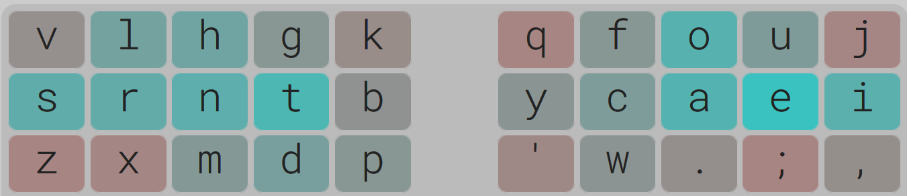
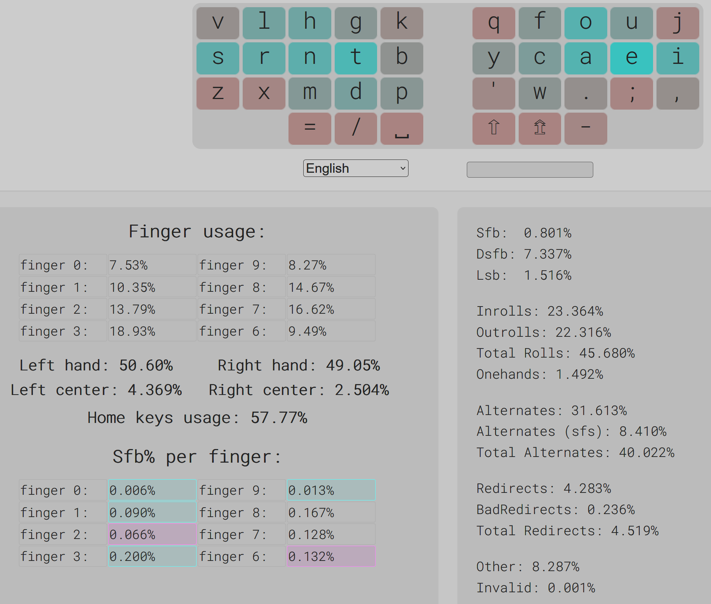
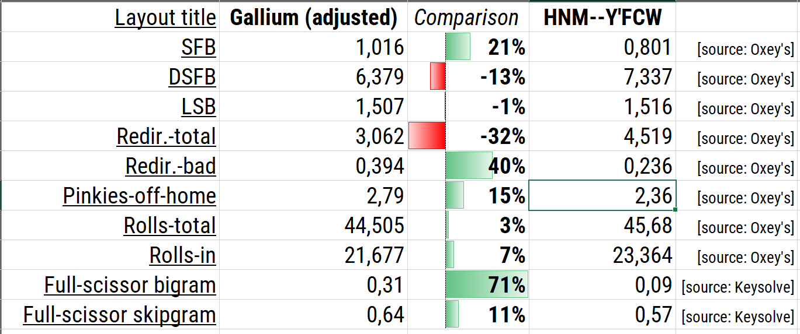
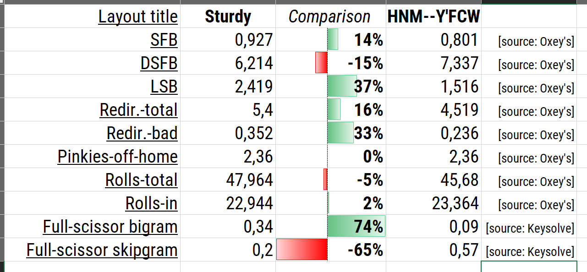
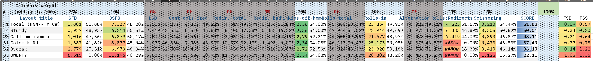

# Focal-keyboard-layout
A high-performing alternative to Gallium, Sturdy and other custom keyboard layouts

- Can easily be made even more comfortable by boosting inrolls using software / firmware to either reverse the TH bigram (so that typing HT will result in TH and TH will result in HT) or implement an HG or MD combo that outputs TH.
- The FY, CY and WY SFBs on vowel index are easy to alt-finger.
